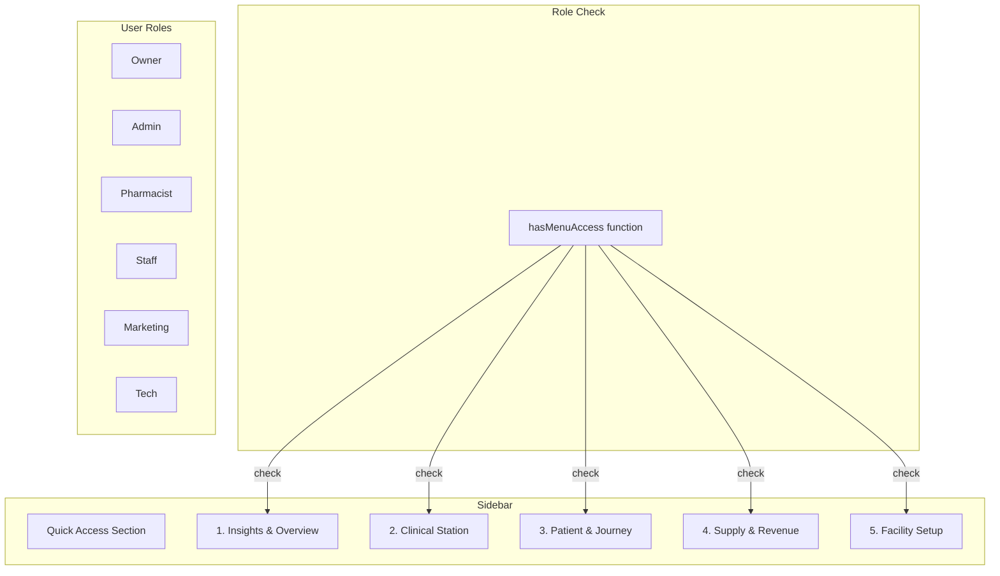

# Design Document: Admin Menu Restructure

## Overview

ปรับโครงสร้างเมนู Admin Dashboard (Sidebar) ใน `includes/header.php` โดยจัดกลุ่มเมนูใหม่เป็น 5 กลุ่มหลัก พร้อมระบบ Role-Based Access Control

**Scope:**
- แก้ไขไฟล์ `includes/header.php` - ปรับโครงสร้าง `$menuSections` array
- เพิ่ม Role checking function สำหรับแต่ละเมนู
- เก็บ Quick Access section ไว้เหมือนเดิม

## Architecture



## Components and Interfaces

### 1. Menu Structure Array (`$menuSections`)

ปรับโครงสร้าง array ใหม่ใน `includes/header.php`:

```php
$menuSections = [
    'quick' => [...], // เก็บไว้เหมือนเดิม
    
    'insights' => [
        'title' => '📊 Insights & Overview',
        'icon' => 'fa-chart-line',
        'collapsible' => true,
        'items' => [...]
    ],
    
    'clinical' => [
        'title' => '🏥 Clinical Station',
        'icon' => 'fa-user-md',
        'collapsible' => true,
        'items' => [...]
    ],
    
    'patient' => [
        'title' => '👤 Patient & Journey',
        'icon' => 'fa-users',
        'collapsible' => true,
        'items' => [...]
    ],
    
    'supply' => [
        'title' => '📦 Supply & Revenue',
        'icon' => 'fa-warehouse',
        'collapsible' => true,
        'items' => [...]
    ],
    
    'facility' => [
        'title' => '⚙️ Facility Setup',
        'icon' => 'fa-cog',
        'collapsible' => true,
        'items' => [...]
    ],
];
```

### 2. Role Access Configuration

เพิ่ม `roles` key ในแต่ละ menu item:

```php
[
    'icon' => 'fa-chart-line',
    'label' => 'Executive Dashboard',
    'url' => '/executive-dashboard',
    'page' => 'executive-dashboard',
    'roles' => ['owner', 'admin']  // เฉพาะ role เหล่านี้เห็นเมนู
]
```

### 3. Role Checking Function

```php
function hasMenuAccess($menuItem) {
    // ถ้าไม่มี roles กำหนด = ทุกคนเข้าได้
    if (!isset($menuItem['roles'])) {
        return true;
    }
    
    $userRole = getCurrentUserRole(); // owner, admin, pharmacist, staff, marketing, tech
    return in_array($userRole, $menuItem['roles']);
}

function getCurrentUserRole() {
    // ใช้ function ที่มีอยู่แล้ว
    if (isSuperAdmin()) return 'owner';
    if (isAdmin()) return 'admin';
    if (isPharmacist()) return 'pharmacist';
    // ... etc
    return 'staff';
}
```

## Data Models

### Menu Item Structure

```php
[
    'icon' => string,           // FontAwesome icon class
    'label' => string,          // ชื่อเมนูภาษาไทย
    'url' => string,            // URL path
    'page' => string,           // page identifier for active state
    'badge' => int|null,        // notification badge count
    'badgeColor' => string,     // badge color class
    'roles' => array|null,      // allowed roles (null = all)
    'folder' => string|null,    // folder for nested pages
]
```

### Role Mapping

| Role | Description | Access Level |
|------|-------------|--------------|
| owner | เจ้าของร้าน/Super Admin | Full access |
| admin | ผู้ดูแลระบบ | Most features |
| pharmacist | เภสัชกร | Clinical + Inventory |
| staff | พนักงาน | Basic operations |
| marketing | การตลาด | Care Journey + Digital Front Door |
| tech | IT/Technical | Integrations |


## Correctness Properties

*A property is a characteristic or behavior that should hold true across all valid executions of a system-essentially, a formal statement about what the system should do. Properties serve as the bridge between human-readable specifications and machine-verifiable correctness guarantees.*

### Property 1: Role-Based Menu Visibility

*For any* user role and *for any* menu item with role restrictions, the menu item SHALL be visible if and only if the user's role is included in the menu item's allowed roles array.

**Validates: Requirements 2.2, 2.3, 3.2, 3.3, 4.2, 4.3, 4.4, 5.2, 5.3, 5.4, 6.2, 6.3, 6.4, 7.1, 7.2**

### Property 2: Menu Group Auto-Expand

*For any* current page URL and *for any* menu group, if the current page URL matches any menu item within that group, the group SHALL be automatically expanded.

**Validates: Requirements 8.3**

### Property 3: Menu Structure Completeness

*For any* menu group in the new structure, the group SHALL contain all menu items as specified in the requirements, and no menu items SHALL be duplicated across groups.

**Validates: Requirements 2.1, 3.1, 4.1, 5.1, 6.1**

---

## Error Handling

### Invalid Role
- ถ้า user ไม่มี role กำหนด → default เป็น 'staff'
- ถ้า role ไม่ตรงกับ role ที่กำหนดไว้ → ซ่อนเมนูนั้น

### Missing Menu Configuration
- ถ้า menu item ไม่มี 'roles' key → แสดงให้ทุกคนเห็น (backward compatible)
- ถ้า menu item ไม่มี 'url' → ไม่แสดงเมนู

### LocalStorage Errors
- ถ้า localStorage ไม่พร้อมใช้งาน → ใช้ default state (collapsed)
- ถ้า stored state เป็น invalid JSON → reset เป็น default

---

## Testing Strategy

### Unit Tests
- ทดสอบ `hasMenuAccess()` function กับ role ต่างๆ
- ทดสอบ `getCurrentUserRole()` function
- ทดสอบ menu structure array มีครบทุก group

### Property-Based Tests (PHPUnit with Faker)
- **Property 1**: Generate random user roles และ menu items, verify visibility matches role permissions
- **Property 2**: Generate random page URLs, verify correct group is expanded
- **Property 3**: Verify all required menu items exist in correct groups

### Integration Tests
- ทดสอบ sidebar render ถูกต้องสำหรับแต่ละ role
- ทดสอบ localStorage persistence ทำงานถูกต้อง

---

## Menu Mapping (Old → New)

### กลุ่ม 1: Insights & Overview
| Old Location | New Menu | URL |
|--------------|----------|-----|
| main → Executive | Executive Dashboard | /executive-dashboard |
| pharmacy → Triage Analytics | Clinical Analytics | /triage-analytics |
| pharmacy → ยาตีกัน | Clinical Analytics | /drug-interactions |
| settings → Activity Logs | Audit Logs | /activity-logs |

### กลุ่ม 2: Clinical Station
| Old Location | New Menu | URL |
|--------------|----------|-----|
| messaging → กล่องข้อความ | Unified Care Chat | /inbox |
| pharmacy → Video Call | Unified Care Chat | /video-call-pro |
| messaging → ตอบอัตโนมัติ | Unified Care Chat | /auto-reply |
| pharmacy → Dashboard เภสัชกร | Roster & Shifts | /pharmacist-dashboard |
| pharmacy → จัดการเภสัชกร | Roster & Shifts | /pharmacists |
| ai → AI ตอบแชท | Medical Copilot (AI) | /ai-chat-settings |
| ai → AI Studio | Medical Copilot (AI) | /ai-studio |
| pharmacy → ตั้งค่า AI เภสัช | Medical Copilot (AI) | /ai-pharmacy-settings |

### กลุ่ม 3: Patient & Journey
| Old Location | New Menu | URL |
|--------------|----------|-----|
| messaging → รายชื่อลูกค้า | EHR (Health Records) | /users |
| messaging → แท็กลูกค้า | EHR (Health Records) | /user-tags |
| membership → จัดการสมาชิก | Membership | /members |
| membership → รางวัลแลกแต้ม | Membership | /admin-rewards |
| membership → ตั้งค่าแต้ม | Membership | /admin-points-settings |
| broadcast → ส่งข้อความ | Care Journey | /broadcast |
| broadcast → แคตตาล็อก | Care Journey | /broadcast-catalog-v2 |
| broadcast → Drip Campaign | Care Journey | /drip-campaigns |
| tools → Rich Menu | Digital Front Door | /rich-menu |
| tools → Dynamic Rich Menu | Digital Front Door | /dynamic-rich-menu |
| settings → ตั้งค่า LIFF | Digital Front Door | /liff-settings |

### กลุ่ม 4: Supply & Revenue
| Old Location | New Menu | URL |
|--------------|----------|-----|
| shop → ออเดอร์ | Billing & Orders | /shop/orders |
| shop → โปรโมชั่น | Billing & Orders | /shop/promotions |
| inventory → สินค้า | Inventory | /shop/products |
| inventory → หมวดหมู่ | Inventory | /shop/categories |
| inventory → * | Inventory | /inventory/* |
| inventory → ใบสั่งซื้อ (PO) | Procurement | /inventory/purchase-orders |
| inventory → รับสินค้า (GR) | Procurement | /inventory/goods-receive |
| inventory → Suppliers | Procurement | /inventory/suppliers |

### กลุ่ม 5: Facility Setup
| Old Location | New Menu | URL |
|--------------|----------|-----|
| shop → ตั้งค่าร้าน | Facility Profile | /shop/settings |
| settings → ผู้ใช้ระบบ | Staff & Roles | /admin-users |
| settings → บัญชี LINE | Integrations | /line-accounts |
| settings → Telegram | Integrations | /telegram |
| ai → ตั้งค่า API Key | Integrations | /ai-settings |
| settings → Consent/PDPA | Consent & PDPA | /consent-management |
