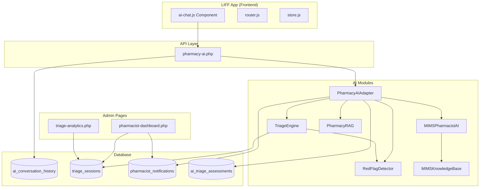

# Design Document: LIFF AI Assistant Integration

## Overview

ระบบ LIFF AI Assistant Integration เชื่อมต่อหน้า `/liff/#/ai-assistant` เข้ากับระบบ AI เภสัชกรที่มีอยู่แล้ว โดยใช้ MIMSPharmacistAI เป็นฐานความรู้หลัก, TriageEngine สำหรับซักประวัติเป็นขั้นตอน, RedFlagDetector สำหรับตรวจจับอาการฉุกเฉิน และเชื่อมต่อกับ pharmacist-dashboard และ triage-analytics สำหรับเภสัชกร

### Key Features
- AI Chat ที่ใช้ MIMS Pharmacy Thailand 2023 เป็นฐานความรู้
- ซักประวัติอาการเป็นขั้นตอนด้วย State Machine
- ตรวจจับอาการฉุกเฉินและแจ้งเตือนทันที
- บันทึกประวัติการสนทนาแยกตามผู้ใช้
- ส่งต่อเภสัชกรจริงเมื่อจำเป็น
- รักษาความต่อเนื่องของการสนทนาภายใน session

## Architecture



## Components and Interfaces

### 1. Frontend Components

#### ai-chat.js (Enhanced)
```javascript
class AIChat {
    constructor(options) {
        this.userId = options.userId;
        this.sessionId = null;
        this.currentState = 'greeting';
        this.triageData = {};
        this.conversationHistory = [];
    }
    
    // Initialize with user context
    async init(container) {
        await this.loadConversationHistory();
        await this.loadTriageSession();
        this.render();
    }
    
    // Process message with session continuity
    async processMessage(message) {
        const response = await fetch('/api/pharmacy-ai.php', {
            method: 'POST',
            body: JSON.stringify({
                message,
                user_id: this.userId,
                session_id: this.sessionId,
                state: this.currentState,
                triage_data: this.triageData,
                use_gemini: true
            })
        });
        // Handle response and update state
    }
}
```

### 2. API Layer

#### pharmacy-ai.php (Enhanced)
```php
// Main entry point for AI chat
// Handles:
// - Message processing with PharmacyAIAdapter
// - Conversation history management
// - Triage session management
// - Red flag detection and logging

function processWithGeminiAI($db, $message, $state, $triageData, $lineAccountId, $userContext, $businessContext) {
    // 1. Load conversation history for context
    $history = getConversationHistory($db, $userContext['line_user_id']);
    
    // 2. Check for red flags first
    $redFlags = checkEmergencySymptoms($message, $userContext);
    
    // 3. Process with PharmacyAIAdapter
    $adapter = new PharmacyAIAdapter($db, $lineAccountId);
    $adapter->setUserId($userContext['id']);
    $result = $adapter->processMessage($message);
    
    // 4. Save conversation
    saveConversationMessage($db, $userContext['line_user_id'], 'user', $message);
    saveConversationMessage($db, $userContext['line_user_id'], 'assistant', $result['response']);
    
    return $result;
}
```

### 3. AI Modules

#### PharmacyAIAdapter
- Entry point สำหรับ AI processing
- รวม RedFlagDetector, PharmacyRAG, TriageEngine
- ใช้ Gemini API พร้อม Function Calling
- รักษา conversation history สำหรับ context

#### MIMSPharmacistAI
- ใช้ MIMSKnowledgeBase เป็นฐานความรู้
- Protocol: Symptom Triage → Red Flag Check → Non-drug Advice → Pharmacotherapy
- Function Calling: searchMIMSDisease, checkRedFlags, searchProducts, getCorticosteroidRecommendation

#### TriageEngine
- State Machine: greeting → symptom → duration → severity → associated → allergy → medical_history → current_meds → recommend → confirm → complete
- บันทึก session ใน triage_sessions table
- ตรวจสอบ Red Flags ทุกขั้นตอน
- สร้าง notification เมื่อ escalate

#### RedFlagDetector
- Critical Flags: เจ็บหน้าอก, หายใจไม่ออก, อาเจียนเป็นเลือด, ชัก, stroke symptoms, แพ้รุนแรง, ฆ่าตัวตาย
- Warning Flags: ไข้สูง, ปวดหัวรุนแรง, ท้องเสียมาก, ปวดท้องรุนแรง
- Age-specific Flags: ทารก, ผู้สูงอายุ

## Data Models

### ai_conversation_history
```sql
CREATE TABLE ai_conversation_history (
    id INT AUTO_INCREMENT PRIMARY KEY,
    user_id INT NOT NULL,
    line_account_id INT,
    session_id VARCHAR(50),
    role ENUM('user', 'assistant') NOT NULL,
    content TEXT NOT NULL,
    created_at TIMESTAMP DEFAULT CURRENT_TIMESTAMP,
    INDEX idx_user_id (user_id),
    INDEX idx_session_id (session_id)
);
```

### triage_sessions
```sql
CREATE TABLE triage_sessions (
    id INT AUTO_INCREMENT PRIMARY KEY,
    user_id INT NOT NULL,
    line_account_id INT,
    current_state VARCHAR(50) DEFAULT 'greeting',
    triage_data JSON,
    status ENUM('active', 'completed', 'escalated', 'cancelled') DEFAULT 'active',
    priority ENUM('normal', 'urgent') DEFAULT 'normal',
    created_at TIMESTAMP DEFAULT CURRENT_TIMESTAMP,
    updated_at TIMESTAMP DEFAULT CURRENT_TIMESTAMP ON UPDATE CURRENT_TIMESTAMP,
    completed_at TIMESTAMP NULL,
    INDEX idx_user_id (user_id),
    INDEX idx_status (status)
);
```

### pharmacist_notifications
```sql
CREATE TABLE pharmacist_notifications (
    id INT AUTO_INCREMENT PRIMARY KEY,
    line_account_id INT,
    type VARCHAR(50) DEFAULT 'triage_alert',
    title VARCHAR(255),
    message TEXT,
    notification_data JSON,
    reference_id INT,
    reference_type VARCHAR(50),
    user_id INT,
    triage_session_id INT,
    priority ENUM('normal', 'urgent') DEFAULT 'normal',
    status ENUM('pending', 'handled', 'dismissed') DEFAULT 'pending',
    is_read TINYINT(1) DEFAULT 0,
    created_at TIMESTAMP DEFAULT CURRENT_TIMESTAMP,
    INDEX idx_line_account (line_account_id),
    INDEX idx_status (status),
    INDEX idx_priority (priority)
);
```

## Correctness Properties

*A property is a characteristic or behavior that should hold true across all valid executions of a system-essentially, a formal statement about what the system should do. Properties serve as the bridge between human-readable specifications and machine-verifiable correctness guarantees.*

### Property 1: Message API Call Consistency
*For any* user message sent through LIFF_AI_Assistant, the pharmacy-ai.php API SHALL be called with user_id and message parameters.
**Validates: Requirements 1.2**

### Property 2: Red Flag Detection Accuracy
*For any* message containing critical red flag patterns (chest pain, difficulty breathing, seizure, stroke symptoms), the RedFlagDetector SHALL return a flag with severity 'critical'.
**Validates: Requirements 3.1**

### Property 3: Emergency Alert Display
*For any* critical red flag detected, the LIFF_AI_Assistant SHALL display an emergency alert containing at least one emergency contact number (1669, 1323, or 1367).
**Validates: Requirements 3.2**

### Property 4: Conversation History Persistence
*For any* message sent by a user, the message SHALL be saved to ai_conversation_history table and retrievable by the same user_id.
**Validates: Requirements 6.1, 6.2**

### Property 5: User-Specific History Isolation
*For any* user clearing their chat history, only that user's conversation history SHALL be deleted, and other users' histories SHALL remain unchanged.
**Validates: Requirements 6.3**

### Property 6: Conversation Context Inclusion
*For any* AI message processing, the system SHALL include at most 10 previous conversation messages as context.
**Validates: Requirements 6.5**

### Property 7: Session Continuity - No Greeting During Active Session
*For any* triage session with state not equal to 'complete' or 'escalate', the AI response SHALL NOT contain greeting phrases like "สวัสดี" or "ยินดีให้บริการ".
**Validates: Requirements 9.1**

### Property 8: Numeric Response Interpretation
*For any* numeric response (1-10) sent when triage state is 'severity', the system SHALL interpret it as severity value and transition to next state.
**Validates: Requirements 9.3**

### Property 9: Duration Response Interpretation
*For any* duration response (containing "วัน", "สัปดาห์", "เดือน") sent when triage state is 'duration', the system SHALL save it as duration value and transition to next state.
**Validates: Requirements 9.4**

### Property 10: State Persistence
*For any* triage session with state not 'complete' or 'escalate', subsequent messages SHALL continue from the current state without resetting to 'greeting'.
**Validates: Requirements 9.5**

### Property 11: Drug Allergy Filtering
*For any* medication recommendation, if the user has recorded drug allergies, the recommended medications SHALL NOT include any medication matching the allergy list.
**Validates: Requirements 7.3**

### Property 12: Drug Interaction Warning
*For any* medication recommendation where interaction is detected with user's current medications, the response SHALL include an interaction warning message.
**Validates: Requirements 7.2, 7.4**

### Property 13: Pharmacist Notification on High Severity
*For any* triage assessment with severity_level 'high' or 'critical', a notification SHALL be created in pharmacist_notifications table.
**Validates: Requirements 4.2**

### Property 14: Triage Session Completion Update
*For any* triage session that reaches 'complete' state, the triage_sessions table SHALL be updated with status 'completed' and completed_at timestamp.
**Validates: Requirements 5.1**

### Property 15: Triage Protocol Sequence
*For any* triage session, the state transitions SHALL follow the sequence: greeting → symptom → duration → severity → associated → allergy → medical_history → current_meds → recommend.
**Validates: Requirements 10.3**

## Error Handling

### API Errors
- Network timeout: Display "ไม่สามารถเชื่อมต่อได้ กรุณาลองใหม่" with retry button
- Server error (5xx): Display "ระบบขัดข้อง กรุณาลองใหม่ภายหลัง"
- Invalid response: Fallback to default error message

### AI Processing Errors
- Gemini API error: Fallback to rule-based response from PharmacyAIAdapter
- Empty response: Display "ขออภัยค่ะ ไม่สามารถประมวลผลได้ กรุณาลองใหม่"
- Rate limit: Queue message and retry with exponential backoff

### Session Errors
- Session not found: Create new session automatically
- State corruption: Reset to 'greeting' state with notification to user

## Testing Strategy

### Unit Testing
- Test RedFlagDetector pattern matching with various symptom inputs
- Test TriageEngine state transitions
- Test conversation history CRUD operations
- Test drug interaction detection logic

### Property-Based Testing
Using PHPUnit with data providers for property-based testing:

1. **Red Flag Detection Property Test**
   - Generate random messages with/without red flag patterns
   - Verify detection accuracy for critical and warning flags

2. **Session Continuity Property Test**
   - Generate sequences of messages within a session
   - Verify no greeting appears during active session

3. **Conversation History Property Test**
   - Generate random user messages
   - Verify save and retrieve consistency per user

4. **Drug Allergy Filtering Property Test**
   - Generate random medication recommendations and allergy lists
   - Verify allergic medications are filtered out

5. **State Transition Property Test**
   - Generate random triage inputs
   - Verify state transitions follow protocol sequence

### Integration Testing
- Test full flow from LIFF to API to AI modules
- Test pharmacist notification creation and display
- Test triage analytics data aggregation
