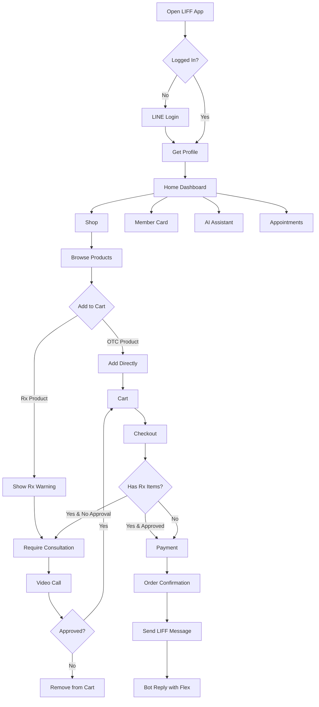
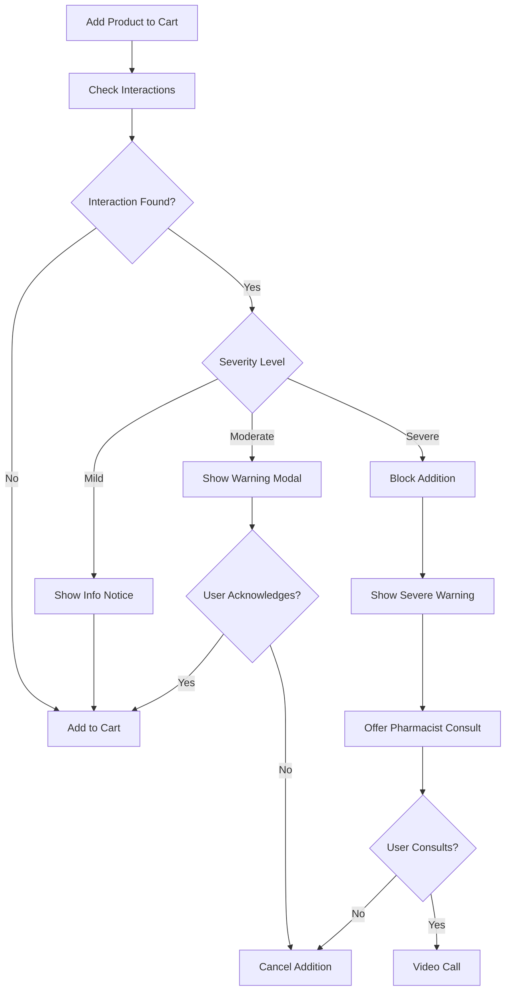
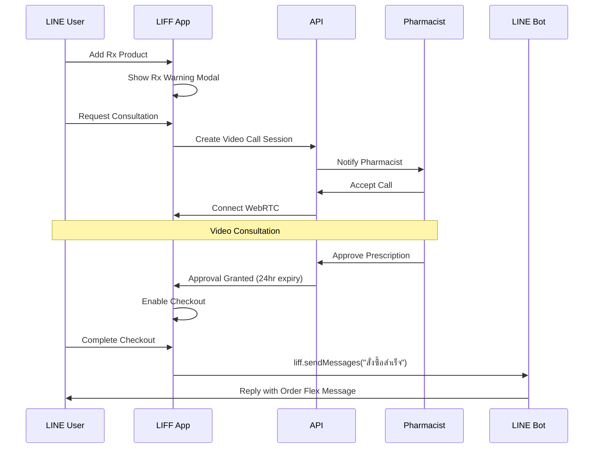
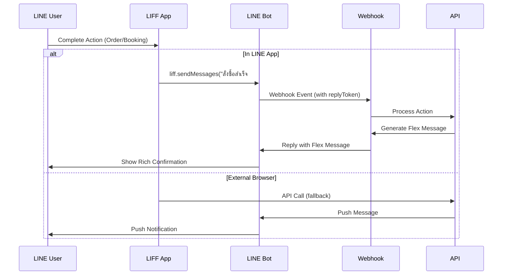
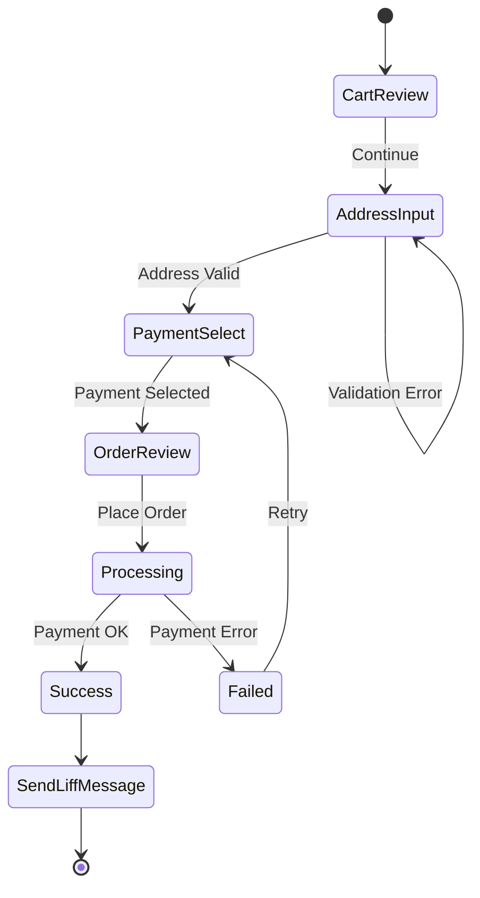
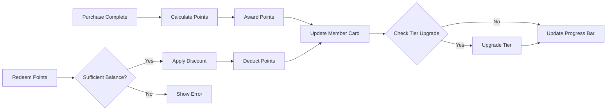

# Design Document: LIFF Telepharmacy Redesign

## Overview

ระบบ LIFF Telepharmacy Redesign เป็น Single Page Application (SPA) ที่ทำงานภายใน LINE App ผ่าน LINE Front-end Framework (LIFF) โดยออกแบบให้เป็น Mobile-First, Performance-Optimized และมี Premium UI/UX สำหรับร้านขายยาออนไลน์ที่ครอบคลุม E-commerce, CRM, และ Telemedicine

### Design Goals
1. **Performance**: First Contentful Paint < 1.5s, Time to Interactive < 3s
2. **Mobile-First**: Touch-friendly (44px min), Responsive, Safe area support
3. **Consistency**: Unified design system with Medical Green (#11B0A6) palette
4. **Offline Support**: Service Worker caching, Graceful degradation
5. **Accessibility**: WCAG 2.1 AA compliance

## Architecture

### High-Level Architecture

```
┌─────────────────────────────────────────────────────────────────┐
│                        LINE App                                  │
│  ┌───────────────────────────────────────────────────────────┐  │
│  │                    LIFF Application                        │  │
│  │  ┌─────────────────────────────────────────────────────┐  │  │
│  │  │              App Shell (SPA Router)                  │  │  │
│  │  │  ┌─────────┬─────────┬─────────┬─────────┬───────┐  │  │  │
│  │  │  │  Home   │  Shop   │  Cart   │ Orders  │Profile│  │  │  │
│  │  │  │Dashboard│  Page   │Checkout │ History │ Page  │  │  │  │
│  │  │  └─────────┴─────────┴─────────┴─────────┴───────┘  │  │  │
│  │  │  ┌─────────────────────────────────────────────────┐  │  │  │
│  │  │  │           Shared Components                      │  │  │  │
│  │  │  │  Header | BottomNav | ProductCard | Skeleton    │  │  │  │
│  │  │  └─────────────────────────────────────────────────┘  │  │  │
│  │  └─────────────────────────────────────────────────────┘  │  │
│  │                          │                                 │  │
│  │                    LIFF SDK v2                             │  │
│  │              (Auth, Profile, sendMessages)                 │  │
│  └───────────────────────────────────────────────────────────┘  │
└─────────────────────────────────────────────────────────────────┘
                              │
                              ▼
┌─────────────────────────────────────────────────────────────────┐
│                      Backend Services                            │
│  ┌─────────────┐  ┌─────────────┐  ┌─────────────────────────┐  │
│  │  REST API   │  │  Webhook    │  │    WebRTC Signaling     │  │
│  │  (PHP)      │  │  Handler    │  │    (Video Call)         │  │
│  └─────────────┘  └─────────────┘  └─────────────────────────┘  │
│         │                │                      │                │
│         ▼                ▼                      ▼                │
│  ┌─────────────────────────────────────────────────────────────┐│
│  │                     MySQL Database                           ││
│  │  users | orders | products | carts | appointments | ...      ││
│  └─────────────────────────────────────────────────────────────┘│
└─────────────────────────────────────────────────────────────────┘
```

### SPA Router Architecture

```
liff/
├── index.php                 # Entry point & Router
├── assets/
│   ├── css/
│   │   └── liff-app.css      # Unified styles
│   └── js/
│       ├── liff-app.js       # Main SPA controller
│       ├── router.js         # Client-side router
│       ├── store.js          # State management
│       └── components/       # Reusable components
│           ├── skeleton.js
│           ├── product-card.js
│           ├── bottom-nav.js
│           └── ...
├── pages/                    # Page modules
│   ├── home.js
│   ├── shop.js
│   ├── checkout.js
│   ├── orders.js
│   ├── member-card.js
│   ├── video-call.js
│   └── ...
└── api/                      # Backend APIs
    ├── products.php
    ├── cart.php
    ├── orders.php
    ├── member.php
    └── ...
```

## Flow Diagrams

### User Journey Flow


### Drug Interaction Check Flow


### Prescription Approval Flow


### LIFF-to-Bot Message Flow


### Checkout Flow


### Member Card & Points Flow


## Components and Interfaces

### Core Components

#### 1. App Shell Component
```javascript
class AppShell {
    constructor(config) {
        this.liffId = config.liffId;
        this.accountId = config.accountId;
        this.router = new Router();
        this.store = new Store();
    }
    
    async init() {
        await this.initLiff();
        this.renderShell();
        this.router.start();
    }
    
    async initLiff() {
        await liff.init({ liffId: this.liffId });
        if (liff.isLoggedIn()) {
            this.store.setProfile(await liff.getProfile());
        }
    }
}
```

#### 2. Router Component
```javascript
class Router {
    routes = {
        '/': 'home',
        '/shop': 'shop',
        '/checkout': 'checkout',
        '/orders': 'orders',
        '/member': 'member-card',
        '/video-call': 'video-call',
        '/appointments': 'appointments',
        '/profile': 'profile',
        '/wishlist': 'wishlist',
        '/coupons': 'coupons',
        '/health-profile': 'health-profile',
        '/notifications': 'notifications'
    };
    
    navigate(path, params = {}) {
        history.pushState(params, '', path);
        this.render(path);
    }
    
    render(path) {
        const page = this.routes[path] || 'home';
        this.loadPage(page);
    }
}
```

#### 3. Product Card Component
```javascript
class ProductCard {
    render(product) {
        return `
        <div class="product-card" data-id="${product.id}">
            ${product.is_prescription ? '<span class="rx-badge">Rx</span>' : ''}
            ${product.is_bestseller ? '<span class="bestseller-badge">🔥</span>' : ''}
            <div class="product-image">
                
                <button class="wishlist-btn" onclick="toggleWishlist(${product.id})">
                    <i class="fa${product.in_wishlist ? 's' : 'r'} fa-heart"></i>
                </button>
            </div>
            <div class="product-info">
                <h3 class="product-name">${product.name}</h3>
                <div class="product-price">
                    ${product.sale_price ? `
                        <span class="sale-price">฿${product.sale_price}</span>
                        <span class="original-price">฿${product.price}</span>
                    ` : `
                        <span class="price">฿${product.price}</span>
                    `}
                </div>
                <button class="add-to-cart-btn" onclick="addToCart(${product.id})">
                    <i class="fas fa-cart-plus"></i> เพิ่มลงตะกร้า
                </button>
            </div>
        </div>
        `;
    }
}
```

#### 4. Skeleton Loading Component
```javascript
class Skeleton {
    static productCard() {
        return `
        <div class="skeleton-card">
            <div class="skeleton skeleton-image"></div>
            <div class="skeleton skeleton-text"></div>
            <div class="skeleton skeleton-text short"></div>
            <div class="skeleton skeleton-button"></div>
        </div>
        `;
    }
    
    static memberCard() {
        return `
        <div class="skeleton-member-card">
            <div class="skeleton skeleton-avatar"></div>
            <div class="skeleton skeleton-text"></div>
            <div class="skeleton skeleton-text short"></div>
        </div>
        `;
    }
}
```

#### 5. Drug Interaction Checker Component
```javascript
class DrugInteractionChecker {
    async checkInteractions(productId, cartItems, userMedications) {
        const response = await fetch('/api/drug-interactions.php', {
            method: 'POST',
            body: JSON.stringify({
                product_id: productId,
                cart_items: cartItems,
                user_medications: userMedications
            })
        });
        return response.json();
    }
    
    showWarning(interaction) {
        const severityColors = {
            'severe': '#EF4444',
            'moderate': '#F59E0B',
            'mild': '#FCD34D'
        };
        
        return `
        <div class="interaction-warning ${interaction.severity}">
            <div class="warning-header" style="background: ${severityColors[interaction.severity]}">
                <i class="fas fa-exclamation-triangle"></i>
                ${interaction.severity === 'severe' ? 'ปฏิกิริยารุนแรง' : 
                  interaction.severity === 'moderate' ? 'ปฏิกิริยาปานกลาง' : 'ปฏิกิริยาเล็กน้อย'}
            </div>
            <div class="warning-body">
                <p><strong>${interaction.drug1}</strong> + <strong>${interaction.drug2}</strong></p>
                <p>${interaction.description}</p>
                <p class="recommendation">${interaction.recommendation}</p>
            </div>
            ${interaction.severity === 'severe' ? `
                <button class="btn-consult" onclick="requestPharmacistConsult()">
                    <i class="fas fa-user-md"></i> ปรึกษาเภสัชกร
                </button>
            ` : `
                <label class="acknowledge-checkbox">
                    <input type="checkbox" onchange="acknowledgeInteraction(${interaction.id})">
                    ฉันรับทราบและยืนยันที่จะเพิ่มสินค้า
                </label>
            `}
        </div>
        `;
    }
}
```

#### 6. LIFF Message Bridge Component
```javascript
class LiffMessageBridge {
    async sendActionMessage(action, data) {
        const messageTemplates = {
            'order_placed': `สั่งซื้อสำเร็จ #${data.orderId}`,
            'appointment_booked': `นัดหมายสำเร็จ ${data.date} ${data.time}`,
            'consult_request': `ขอปรึกษาเภสัชกร`,
            'points_redeemed': `แลกแต้มสำเร็จ ${data.points} แต้ม`,
            'health_updated': `อัพเดทข้อมูลสุขภาพ`
        };
        
        const message = messageTemplates[action];
        
        if (liff.isInClient()) {
            try {
                await liff.sendMessages([{ type: 'text', text: message }]);
                return { success: true, method: 'liff' };
            } catch (e) {
                console.error('LIFF sendMessages failed:', e);
            }
        }
        
        // Fallback to API
        return this.sendViaApi(action, data);
    }
    
    async sendViaApi(action, data) {
        const response = await fetch('/api/liff-bridge.php', {
            method: 'POST',
            body: JSON.stringify({ action, data, user_id: store.userId })
        });
        return response.json();
    }
}
```

### API Interfaces

#### Products API
```
GET  /api/products.php?category={id}&page={n}&limit={n}
GET  /api/products.php?search={query}
GET  /api/products.php?id={product_id}
POST /api/products.php/check-interaction
```

#### Cart API
```
GET  /api/cart.php?user_id={id}
POST /api/cart.php/add
POST /api/cart.php/update
POST /api/cart.php/remove
POST /api/cart.php/clear
```

#### Orders API
```
GET  /api/orders.php?user_id={id}
GET  /api/orders.php?order_id={id}
POST /api/orders.php/create
POST /api/orders.php/cancel
```

#### Member API
```
GET  /api/member.php?action=get_card&user_id={id}
GET  /api/member.php?action=get_points&user_id={id}
POST /api/member.php/redeem
```

## Data Models

### User Profile
```php
class UserProfile {
    public int $id;
    public string $line_user_id;
    public string $display_name;
    public ?string $picture_url;
    public ?string $phone;
    public ?string $email;
    public int $line_account_id;
    public DateTime $created_at;
}
```

### Product
```php
class Product {
    public int $id;
    public string $name;
    public string $sku;
    public float $price;
    public ?float $sale_price;
    public int $stock;
    public string $image_url;
    public int $category_id;
    public bool $is_prescription;  // Rx required
    public bool $is_featured;
    public bool $is_bestseller;
    public ?string $generic_name;
    public ?string $usage;
    public ?string $warnings;
    public array $interactions;    // Drug interaction data
}
```

### Cart
```php
class Cart {
    public int $id;
    public int $user_id;
    public array $items;           // CartItem[]
    public float $subtotal;
    public float $discount;
    public ?string $coupon_code;
    public float $shipping_fee;
    public float $total;
    public bool $has_prescription; // Contains Rx items
    public ?int $prescription_approval_id;
}

class CartItem {
    public int $product_id;
    public string $name;
    public float $price;
    public int $quantity;
    public bool $is_prescription;
    public array $acknowledged_interactions;
}
```

### Order
```php
class Order {
    public int $id;
    public string $order_id;       // ORD-YYYYMMDD-XXXX
    public int $user_id;
    public array $items;
    public float $total;
    public string $status;         // pending, confirmed, packing, shipping, delivered
    public string $payment_method;
    public ?string $payment_slip;
    public ?string $tracking_number;
    public ?string $carrier;
    public Address $shipping_address;
    public ?int $prescription_approval_id;
    public DateTime $created_at;
    public ?DateTime $shipped_at;
    public ?DateTime $delivered_at;
}
```

### Drug Interaction
```php
class DrugInteraction {
    public int $id;
    public int $drug1_id;
    public int $drug2_id;
    public string $severity;       // mild, moderate, severe
    public string $description;
    public string $recommendation;
    public string $mechanism;
}
```

### Health Profile
```php
class HealthProfile {
    public int $user_id;
    public ?int $age;
    public ?string $gender;
    public ?float $weight;
    public ?float $height;
    public ?string $blood_type;
    public array $medical_conditions;  // ['diabetes', 'hypertension', ...]
    public array $allergies;           // DrugAllergy[]
    public array $current_medications; // Medication[]
    public DateTime $updated_at;
}

class DrugAllergy {
    public string $drug_name;
    public string $reaction_type;  // rash, breathing, swelling, other
    public ?string $notes;
}

class Medication {
    public string $name;
    public string $dosage;
    public string $frequency;
    public ?DateTime $start_date;
}
```

### Prescription Approval
```php
class PrescriptionApproval {
    public int $id;
    public int $user_id;
    public int $pharmacist_id;
    public array $approved_items;
    public string $status;         // pending, approved, rejected
    public ?string $notes;
    public ?int $video_call_id;
    public DateTime $created_at;
    public DateTime $expires_at;   // 24 hours from approval
}
```


## Correctness Properties

*A property is a characteristic or behavior that should hold true across all valid executions of a system-essentially, a formal statement about what the system should do. Properties serve as the bridge between human-readable specifications and machine-verifiable correctness guarantees.*

### Property 1: Cart Serialization Round-Trip
*For any* valid cart object, serializing to JSON and then deserializing should produce an equivalent cart object with identical items, quantities, and totals.
**Validates: Requirements 2.9, 2.10**

### Property 2: Touch Target Minimum Size
*For any* interactive element (button, link, input) in the LIFF app, the computed height and width should be at least 44 pixels.
**Validates: Requirements 1.5**

### Property 3: Product Card Required Elements
*For any* product displayed in the shop, the Product_Card component should contain: image, name, price, and "Add to Cart" button.
**Validates: Requirements 2.3**

### Property 4: Cart Summary Visibility
*For any* cart state where item count > 0, the floating Cart_Summary bar should be visible with correct item count and total.
**Validates: Requirements 2.5**

### Property 5: Form Validation State Consistency
*For any* checkout form state, the "Place Order" button should be disabled if and only if at least one required field is empty or invalid.
**Validates: Requirements 3.6, 3.7**

### Property 6: Order History Sorting
*For any* list of orders displayed in Order History, the orders should be sorted by created_at in descending order (newest first).
**Validates: Requirements 4.1**

### Property 7: Order Status Badge Presence
*For any* order displayed in Order History, a status badge should be present with one of the valid statuses: Pending, Confirmed, Packing, Shipping, Delivered.
**Validates: Requirements 4.2**

### Property 8: QR Code Validity
*For any* Member_Card displayed, the generated QR code should be valid and contain the member's ID when decoded.
**Validates: Requirements 5.3**

### Property 9: Tier Progress Bounds
*For any* tier progress bar displayed, the progress percentage should be between 0 and 100 inclusive.
**Validates: Requirements 5.4**

### Property 10: Prescription Badge Display
*For any* product where is_prescription is true, the Product_Card should display an "Rx" badge.
**Validates: Requirements 11.1**

### Property 11: Prescription Checkout Block
*For any* cart containing prescription items without valid approval, the checkout process should be blocked and require pharmacist consultation.
**Validates: Requirements 11.3**

### Property 12: Prescription Approval Expiry
*For any* prescription approval granted, the expires_at timestamp should be exactly 24 hours after the created_at timestamp.
**Validates: Requirements 11.9**

### Property 13: Drug Interaction Check Trigger
*For any* product added to cart, the system should check for interactions with existing cart items and user medication history.
**Validates: Requirements 12.1**

### Property 14: Severe Interaction Block
*For any* drug interaction with severity "severe", the product addition should be blocked and require pharmacist consultation.
**Validates: Requirements 12.4**

### Property 15: Moderate Interaction Acknowledgment
*For any* drug interaction with severity "moderate", the product addition should be allowed only after user acknowledgment.
**Validates: Requirements 12.5**

### Property 16: Promo Code Validation Response
*For any* promo code entered, the system should return a validation result (valid with discount amount, or invalid with error reason) within 500ms.
**Validates: Requirements 17.5, 17.6, 17.7**

### Property 17: Health Profile Interaction Check
*For any* medication added to Health Profile, the system should check for interactions with existing medications.
**Validates: Requirements 18.7**

### Property 18: LIFF Message Fallback
*For any* LIFF action that requires bot notification, if liff.sendMessages() is not available, the system should fallback to API-based notification.
**Validates: Requirements 20.1, 20.10**

### Property 19: Auto-fill from LINE Profile
*For any* checkout page load where LINE profile is available, the customer name field should be pre-filled with the profile display name.
**Validates: Requirements 3.2**

### Property 20: Infinite Scroll Loading
*For any* scroll event that reaches the bottom of the product list, additional products should be loaded if more products exist.
**Validates: Requirements 2.6**

## Error Handling

### Network Errors
```javascript
class ErrorHandler {
    static async handleApiError(error, retryFn) {
        if (error.name === 'NetworkError' || !navigator.onLine) {
            return this.showOfflineError(retryFn);
        }
        
        if (error.status === 401) {
            return this.handleAuthError();
        }
        
        if (error.status === 429) {
            return this.showRateLimitError();
        }
        
        return this.showGenericError(error.message);
    }
    
    static showOfflineError(retryFn) {
        return `
        <div class="error-state">
            <i class="fas fa-wifi-slash"></i>
            <h3>ไม่มีการเชื่อมต่ออินเทอร์เน็ต</h3>
            <p>กรุณาตรวจสอบการเชื่อมต่อและลองใหม่</p>
            <button onclick="${retryFn}" class="btn-retry">
                <i class="fas fa-redo"></i> ลองใหม่
            </button>
        </div>
        `;
    }
}
```

### Validation Errors
```javascript
class FormValidator {
    static rules = {
        phone: /^0[0-9]{9}$/,
        email: /^[^\s@]+@[^\s@]+\.[^\s@]+$/,
        postalCode: /^[0-9]{5}$/
    };
    
    static validate(field, value) {
        const rule = this.rules[field];
        if (!rule) return { valid: true };
        
        const valid = rule.test(value);
        return {
            valid,
            message: valid ? null : this.getErrorMessage(field)
        };
    }
    
    static getErrorMessage(field) {
        const messages = {
            phone: 'กรุณากรอกเบอร์โทรศัพท์ 10 หลัก',
            email: 'กรุณากรอกอีเมลให้ถูกต้อง',
            postalCode: 'กรุณากรอกรหัสไปรษณีย์ 5 หลัก'
        };
        return messages[field];
    }
}
```

## Testing Strategy

### Dual Testing Approach

This system uses both unit tests and property-based tests:
- **Unit tests**: Verify specific examples, edge cases, and error conditions
- **Property-based tests**: Verify universal properties that should hold across all inputs

### Property-Based Testing Library
- **Library**: fast-check (JavaScript)
- **Minimum iterations**: 100 per property

### Unit Tests
```javascript
// Example unit tests
describe('ProductCard', () => {
    it('should display Rx badge for prescription products', () => {
        const product = { id: 1, name: 'Test', is_prescription: true };
        const card = new ProductCard().render(product);
        expect(card).toContain('rx-badge');
    });
    
    it('should show sale price when available', () => {
        const product = { id: 1, price: 100, sale_price: 80 };
        const card = new ProductCard().render(product);
        expect(card).toContain('sale-price');
        expect(card).toContain('฿80');
    });
});
```

### Property-Based Tests
```javascript
import * as fc from 'fast-check';

// **Feature: liff-telepharmacy-redesign, Property 1: Cart Serialization Round-Trip**
// **Validates: Requirements 2.9, 2.10**
describe('Cart Serialization', () => {
    it('should round-trip serialize/deserialize cart', () => {
        fc.assert(
            fc.property(
                fc.record({
                    items: fc.array(fc.record({
                        product_id: fc.integer({ min: 1 }),
                        quantity: fc.integer({ min: 1, max: 100 }),
                        price: fc.float({ min: 0, max: 10000 })
                    })),
                    coupon_code: fc.option(fc.string())
                }),
                (cart) => {
                    const serialized = JSON.stringify(cart);
                    const deserialized = JSON.parse(serialized);
                    return JSON.stringify(deserialized) === serialized;
                }
            ),
            { numRuns: 100 }
        );
    });
});

// **Feature: liff-telepharmacy-redesign, Property 5: Form Validation State Consistency**
// **Validates: Requirements 3.6, 3.7**
describe('Checkout Form Validation', () => {
    it('should disable button iff form is invalid', () => {
        fc.assert(
            fc.property(
                fc.record({
                    name: fc.string(),
                    phone: fc.string(),
                    address: fc.string()
                }),
                (formData) => {
                    const isValid = formData.name.length > 0 && 
                                   /^0[0-9]{9}$/.test(formData.phone) &&
                                   formData.address.length > 0;
                    const buttonDisabled = !isValid;
                    return validateForm(formData).buttonDisabled === buttonDisabled;
                }
            ),
            { numRuns: 100 }
        );
    });
});

// **Feature: liff-telepharmacy-redesign, Property 12: Prescription Approval Expiry**
// **Validates: Requirements 11.9**
describe('Prescription Approval', () => {
    it('should set expiry to 24 hours after approval', () => {
        fc.assert(
            fc.property(
                fc.date({ min: new Date('2024-01-01'), max: new Date('2025-12-31') }),
                (approvalDate) => {
                    const approval = createPrescriptionApproval(approvalDate);
                    const expectedExpiry = new Date(approvalDate.getTime() + 24 * 60 * 60 * 1000);
                    return approval.expires_at.getTime() === expectedExpiry.getTime();
                }
            ),
            { numRuns: 100 }
        );
    });
});
```

## UI/UX Guidelines

### Color Palette
```css
:root {
    /* Primary Colors */
    --primary: #11B0A6;           /* Medical Green */
    --primary-dark: #0D8A82;
    --primary-light: #E6F7F6;
    
    /* Secondary Colors */
    --secondary: #3B82F6;         /* Trust Blue */
    --secondary-dark: #2563EB;
    --secondary-light: #EFF6FF;
    
    /* Accent Colors */
    --danger: #EF4444;            /* Red - Errors, Severe */
    --warning: #F59E0B;           /* Orange - Warnings, Moderate */
    --success: #10B981;           /* Green - Success */
    --info: #3B82F6;              /* Blue - Info */
    
    /* Neutral Colors */
    --bg-light: #F8FAFC;
    --bg-white: #FFFFFF;
    --text-primary: #1F2937;
    --text-secondary: #6B7280;
    --text-muted: #9CA3AF;
    --border: #E5E7EB;
    
    /* Tier Colors */
    --tier-silver: linear-gradient(135deg, #C0C0C0, #A0A0A0);
    --tier-gold: linear-gradient(135deg, #FFD700, #FFA500);
    --tier-platinum: linear-gradient(135deg, #334155, #0F172A);
}
```

### Typography
```css
body {
    font-family: 'Sarabun', -apple-system, BlinkMacSystemFont, sans-serif;
    font-size: 14px;
    line-height: 1.5;
    color: var(--text-primary);
}

h1 { font-size: 24px; font-weight: 700; }
h2 { font-size: 20px; font-weight: 600; }
h3 { font-size: 16px; font-weight: 600; }
.text-sm { font-size: 12px; }
.text-xs { font-size: 10px; }
```

### Spacing System
```css
/* 4px base unit */
--space-1: 4px;
--space-2: 8px;
--space-3: 12px;
--space-4: 16px;
--space-5: 20px;
--space-6: 24px;
--space-8: 32px;
```

### Component Styles
```css
/* Buttons */
.btn {
    min-height: 44px;
    padding: 12px 24px;
    border-radius: 12px;
    font-weight: 600;
    transition: all 0.15s;
}

.btn-primary {
    background: var(--primary);
    color: white;
}

.btn-primary:active {
    transform: scale(0.98);
    background: var(--primary-dark);
}

/* Cards */
.card {
    background: var(--bg-white);
    border-radius: 16px;
    box-shadow: 0 2px 8px rgba(0,0,0,0.06);
    padding: var(--space-4);
}

/* Bottom Navigation */
.bottom-nav {
    position: fixed;
    bottom: 0;
    left: 0;
    right: 0;
    background: white;
    padding: 12px 0 max(12px, env(safe-area-inset-bottom));
    box-shadow: 0 -4px 15px rgba(0,0,0,0.05);
    z-index: 50;
}
```

### Animation Guidelines
```css
/* Transitions */
.transition-fast { transition: all 0.15s ease; }
.transition-normal { transition: all 0.3s ease; }

/* Skeleton Loading */
@keyframes skeleton-pulse {
    0% { background-position: 200% 0; }
    100% { background-position: -200% 0; }
}

.skeleton {
    background: linear-gradient(90deg, #f0f0f0 25%, #e0e0e0 50%, #f0f0f0 75%);
    background-size: 200% 100%;
    animation: skeleton-pulse 1.5s infinite;
}

/* Page Transitions */
.page-enter {
    opacity: 0;
    transform: translateX(20px);
}

.page-enter-active {
    opacity: 1;
    transform: translateX(0);
    transition: all 0.3s ease;
}
```
