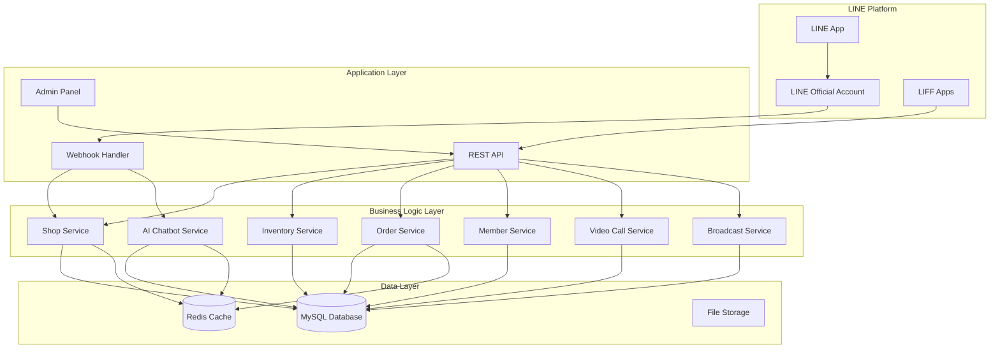
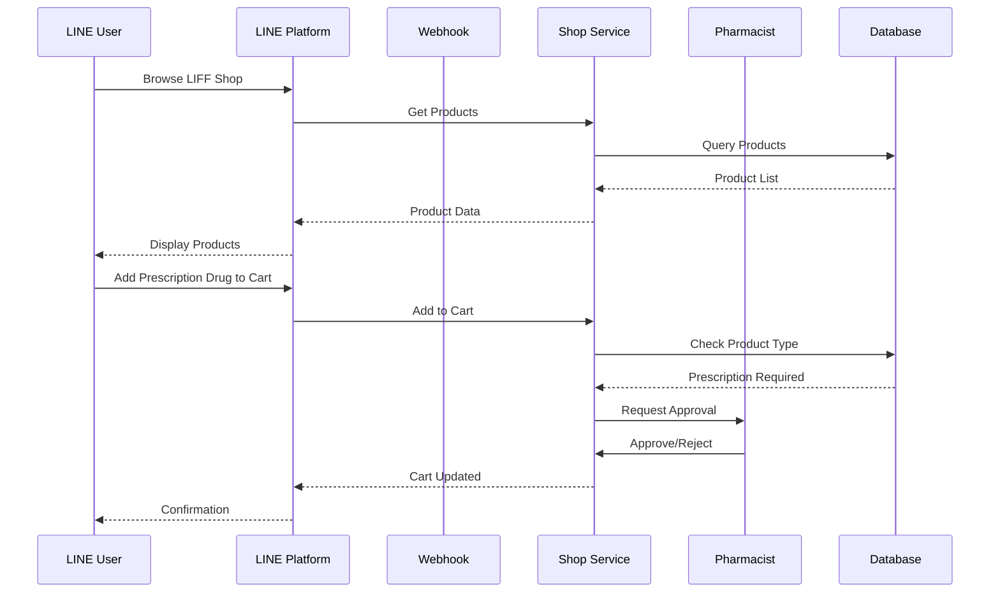

# Design Document: Pharmacy E-commerce Architecture

## Overview

ระบบ E-commerce ร้านขายยาออนไลน์ผ่าน LINE เป็นแพลตฟอร์มที่ออกแบบมาเพื่อรองรับการขายยาและเวชภัณฑ์ทั้งประเภท OTC (ซื้อได้ทั่วไป) และ Prescription (ต้องมีเภสัชกรอนุมัติ) โดยใช้ LINE Official Account เป็นช่องทางหลักในการติดต่อลูกค้า

### Key Design Goals
- **Regulatory Compliance**: แยกประเภทยาและควบคุมการจำหน่ายยาที่ต้องมีใบสั่งแพทย์
- **Seamless LINE Integration**: ใช้ LIFF สำหรับ UI และ LINE Messaging API สำหรับการสื่อสาร
- **Real-time Consultation**: รองรับ Video Call ระหว่างลูกค้าและเภสัชกร
- **Inventory Accuracy**: ระบบจัดการสต็อกที่แม่นยำและ real-time
- **Multi-tenant Support**: รองรับหลาย LINE OA ในระบบเดียว

## Architecture

### High-Level Architecture Diagram



### System Flow Diagram



## Components and Interfaces

### 1. Product Service

```php
interface ProductServiceInterface {
    public function createProduct(array $data): Product;
    public function getProduct(int $id): ?Product;
    public function listProducts(array $filters): array;
    public function updateProduct(int $id, array $data): Product;
    public function deleteProduct(int $id): bool;
    public function checkProductType(int $productId): string; // 'OTC' or 'Prescription'
}
```

### 2. Cart Service

```php
interface CartServiceInterface {
    public function addToCart(string $userId, int $productId, int $quantity): Cart;
    public function removeFromCart(string $userId, int $productId): Cart;
    public function getCart(string $userId): Cart;
    public function clearCart(string $userId): bool;
    public function validateCartStock(string $userId): ValidationResult;
    public function calculateTotal(string $userId): CartTotal;
}
```

### 3. Order Service

```php
interface OrderServiceInterface {
    public function createOrder(string $userId, array $cartItems, array $paymentInfo): Order;
    public function getOrder(string $orderId): ?Order;
    public function listOrders(string $userId): array;
    public function updateOrderStatus(string $orderId, string $status): Order;
    public function uploadPaymentSlip(string $orderId, string $slipPath): Order;
    public function verifyPayment(string $orderId, bool $approved, ?string $reason): Order;
    public function serializeOrder(Order $order): string; // JSON encoding
    public function deserializeOrder(string $json): Order; // JSON decoding
}
```

### 4. Inventory Service

```php
interface InventoryServiceInterface {
    public function getStock(int $productId): int;
    public function adjustStock(int $productId, int $quantity, string $reason): StockMovement;
    public function receiveGoods(int $poId, array $items): array;
    public function createPurchaseOrder(array $data): PurchaseOrder;
    public function getStockMovements(array $filters): array;
    public function checkLowStock(): array;
}
```

### 5. Prescription Approval Service

```php
interface PrescriptionApprovalServiceInterface {
    public function requestApproval(string $orderId, array $prescriptionItems): ApprovalRequest;
    public function approveOrder(string $requestId, int $pharmacistId, ?string $notes): ApprovalResult;
    public function rejectOrder(string $requestId, int $pharmacistId, string $reason): ApprovalResult;
    public function getPendingApprovals(int $pharmacistId): array;
}
```

### 6. Video Call Service

```php
interface VideoCallServiceInterface {
    public function createSession(string $userId): VideoCallSession;
    public function acceptSession(string $sessionId, int $pharmacistId): VideoCallSession;
    public function endSession(string $sessionId, ?string $notes): VideoCallSession;
    public function getActiveSession(string $userId): ?VideoCallSession;
    public function getSessionHistory(string $userId): array;
}
```

### 7. Member Service

```php
interface MemberServiceInterface {
    public function register(string $lineUserId, array $profile): Member;
    public function getMember(string $lineUserId): ?Member;
    public function updateMember(string $lineUserId, array $data): Member;
    public function getPointBalance(string $lineUserId): int;
    public function earnPoints(string $lineUserId, int $orderId, int $amount): PointTransaction;
    public function redeemPoints(string $lineUserId, int $points): PointTransaction;
    public function getPointHistory(string $lineUserId): array;
}
```

### 8. LINE Account Service

```php
interface LineAccountServiceInterface {
    public function addAccount(array $credentials): LineAccount;
    public function getAccount(int $id): ?LineAccount;
    public function listAccounts(): array;
    public function updateAccount(int $id, array $data): LineAccount;
    public function generateWebhookUrl(int $accountId): string;
    public function routeWebhook(string $webhookPath): ?LineAccount;
}
```

## Data Models

### Product Model

```php
class Product {
    public int $id;
    public int $lineAccountId;
    public string $name;
    public string $description;
    public float $price;
    public int $stock;
    public string $productType; // 'OTC' | 'Prescription'
    public ?string $imageUrl;
    public int $reorderThreshold;
    public bool $isActive;
    public DateTime $createdAt;
    public DateTime $updatedAt;
}
```

### Order Model

```php
class Order {
    public string $id;
    public string $userId;
    public int $lineAccountId;
    public array $items; // OrderItem[]
    public float $subtotal;
    public float $discount;
    public float $total;
    public string $status; // 'pending' | 'awaiting_approval' | 'approved' | 'paid' | 'shipped' | 'completed' | 'cancelled'
    public ?string $paymentSlipUrl;
    public ?string $prescriptionApprovalId;
    public DateTime $createdAt;
    public DateTime $updatedAt;
}
```

### Stock Movement Model

```php
class StockMovement {
    public int $id;
    public int $productId;
    public int $quantity; // positive for in, negative for out
    public string $movementType; // 'purchase' | 'sale' | 'adjustment' | 'return'
    public ?int $referenceId; // order_id or po_id
    public string $reason;
    public int $createdBy;
    public DateTime $createdAt;
}
```

### Video Call Session Model

```php
class VideoCallSession {
    public string $id;
    public string $userId;
    public ?int $pharmacistId;
    public string $status; // 'waiting' | 'active' | 'ended'
    public ?DateTime $startedAt;
    public ?DateTime $endedAt;
    public ?int $duration; // seconds
    public ?string $notes;
    public DateTime $createdAt;
}
```

### Point Transaction Model

```php
class PointTransaction {
    public int $id;
    public string $userId;
    public int $points; // positive for earn, negative for redeem
    public string $transactionType; // 'earn' | 'redeem' | 'expire' | 'adjust'
    public ?int $orderId;
    public int $balanceAfter;
    public DateTime $createdAt;
}
```

## Correctness Properties

*A property is a characteristic or behavior that should hold true across all valid executions of a system-essentially, a formal statement about what the system should do. Properties serve as the bridge between human-readable specifications and machine-verifiable correctness guarantees.*

### Property 1: Product Type Validation
*For any* product created in the system, the product_type field SHALL be either 'OTC' or 'Prescription', and no other value shall be accepted.
**Validates: Requirements 1.1**

### Property 2: OTC Product Cart Addition
*For any* OTC product and any valid user, adding the product to cart SHALL succeed immediately without requiring additional approval steps.
**Validates: Requirements 1.2**

### Property 3: Prescription Order Blocking
*For any* order containing at least one Prescription_Product, the order status SHALL remain in 'awaiting_approval' state until a Pharmacist explicitly approves or rejects it.
**Validates: Requirements 1.3**

### Property 4: Prescription Rejection Cleanup
*For any* rejected prescription order, the prescription items SHALL be removed from the order and the user SHALL receive a notification containing the rejection reason.
**Validates: Requirements 1.5**

### Property 5: Video Session Creation
*For any* consultation request from a valid user, a Video_Call_Session record SHALL be created with status 'waiting' and all available pharmacists SHALL be notified.
**Validates: Requirements 2.1**

### Property 6: Video Session Recording
*For any* ended Video_Call_Session, the session record SHALL contain non-null values for duration (calculated from startedAt to endedAt) and the session SHALL be persisted to the database.
**Validates: Requirements 2.4**

### Property 7: Product Display Completeness
*For any* product displayed in the LIFF shop, the product record SHALL contain non-empty values for name, price, and stock quantity.
**Validates: Requirements 3.1**

### Property 8: Cart State Persistence
*For any* cart modification (add/remove/update), the cart state SHALL be persisted such that retrieving the cart returns the same items and quantities.
**Validates: Requirements 3.2**

### Property 9: Stock Validation at Checkout
*For any* checkout attempt, all cart items SHALL be validated against current stock levels, and checkout SHALL only proceed if all items have sufficient stock.
**Validates: Requirements 3.3**

### Property 10: Order Stock Reduction
*For any* completed order, the stock quantity for each ordered product SHALL be reduced by exactly the ordered quantity, and a corresponding Stock_Movement record SHALL be created.
**Validates: Requirements 3.5**

### Property 11: Order Data Round-Trip
*For any* valid Order object, serializing to JSON and then deserializing SHALL produce an Order object equivalent to the original.
**Validates: Requirements 4.5, 4.6**

### Property 12: Payment Slip State Transition
*For any* uploaded payment slip, the order status SHALL transition to 'pending_verification' and the slip URL SHALL be stored in the order record.
**Validates: Requirements 4.2**

### Property 13: Low Stock Alert Generation
*For any* product whose stock falls below its reorder_threshold, a low stock alert SHALL be generated for admin users.
**Validates: Requirements 5.1**

### Property 14: Purchase Order Recording
*For any* created Purchase_Order, the record SHALL contain non-null values for supplier_id, at least one product item, quantities, and expected_delivery_date.
**Validates: Requirements 5.2**

### Property 15: Goods Receipt Stock Update
*For any* goods received against a Purchase_Order, the stock quantity for each received product SHALL increase by exactly the received quantity, and Stock_Movement records SHALL be created.
**Validates: Requirements 5.3**

### Property 16: Stock Movement Query Filtering
*For any* stock movement query with date range and movement type filters, all returned movements SHALL match the specified filter criteria.
**Validates: Requirements 5.5**

### Property 17: Points Calculation
*For any* completed purchase, the awarded Loyalty_Points SHALL equal the order total multiplied by the configured points rate (rounded down to integer).
**Validates: Requirements 6.1**

### Property 18: Points Redemption Validation
*For any* points redemption request, if the requested points exceed the user's available balance, the redemption SHALL be rejected and the balance SHALL remain unchanged.
**Validates: Requirements 6.3, 6.4**

### Property 19: Points Transaction Recording
*For any* points change (earn or redeem), a PointTransaction record SHALL be created with the correct transaction_type, points amount, and updated balance_after value.
**Validates: Requirements 6.5**

### Property 20: Webhook URL Uniqueness
*For any* LINE OA account added to the system, the generated webhook URL SHALL be unique across all accounts.
**Validates: Requirements 7.1**

### Property 21: Webhook Routing Accuracy
*For any* webhook request, the system SHALL correctly identify and route to the LINE OA account matching the webhook path.
**Validates: Requirements 7.2**

### Property 22: Broadcast Account Isolation
*For any* broadcast sent to a specific LINE OA account, only users belonging to that account SHALL receive the message.
**Validates: Requirements 7.4**

### Property 23: Auto-Reply Keyword Matching
*For any* incoming message matching configured auto-reply keywords, the system SHALL respond with the corresponding configured reply message.
**Validates: Requirements 8.1**

### Property 24: Red Flag Alert
*For any* AI-detected emergency symptom (red flag), the system SHALL immediately create an alert for pharmacists and include emergency care advice in the user response.
**Validates: Requirements 8.3**

### Property 25: Scheduled Broadcast Timing
*For any* scheduled broadcast, the messages SHALL be sent within 1 minute of the specified scheduled time.
**Validates: Requirements 9.2**

### Property 26: Unsubscribe Exclusion
*For any* user who has unsubscribed, they SHALL NOT receive any future broadcast messages.
**Validates: Requirements 9.5**

### Property 27: Report Data Aggregation
*For any* sales report with specified date range and filters, the aggregated totals SHALL equal the sum of individual order totals matching the criteria.
**Validates: Requirements 10.2**

## Error Handling

### Error Categories

1. **Validation Errors (4xx)**
   - Invalid product type
   - Insufficient stock
   - Invalid payment slip
   - Insufficient points balance

2. **Authorization Errors (401/403)**
   - Unauthenticated user
   - Pharmacist approval required
   - Admin-only operation

3. **Business Logic Errors**
   - Order already processed
   - Session already ended
   - Product discontinued

4. **System Errors (5xx)**
   - Database connection failure
   - LINE API failure
   - File storage failure

### Error Response Format

```php
class ErrorResponse {
    public string $code;      // e.g., 'INSUFFICIENT_STOCK'
    public string $message;   // Human-readable message
    public ?array $details;   // Additional context
    public string $timestamp;
}
```

### Error Handling Strategy

```php
try {
    $result = $orderService->createOrder($userId, $cartItems, $paymentInfo);
} catch (InsufficientStockException $e) {
    return new ErrorResponse('INSUFFICIENT_STOCK', 'สินค้าบางรายการหมด', $e->getItems());
} catch (PrescriptionRequiredException $e) {
    return new ErrorResponse('PRESCRIPTION_REQUIRED', 'ต้องได้รับการอนุมัติจากเภสัชกร', $e->getItems());
} catch (DatabaseException $e) {
    log_error($e);
    return new ErrorResponse('SYSTEM_ERROR', 'เกิดข้อผิดพลาด กรุณาลองใหม่');
}
```

## Testing Strategy

### Dual Testing Approach

ระบบนี้ใช้ทั้ง Unit Testing และ Property-Based Testing เพื่อให้ครอบคลุมการทดสอบ:

- **Unit Tests**: ทดสอบ specific examples, edge cases, และ error conditions
- **Property-Based Tests**: ทดสอบ universal properties ที่ต้องเป็นจริงสำหรับทุก input

### Property-Based Testing Framework

ใช้ **PHPUnit** ร่วมกับ **Eris** (PHP Property-Based Testing Library) สำหรับ property-based testing

```php
use Eris\Generator;
use Eris\TestTrait;

class OrderPropertyTest extends TestCase {
    use TestTrait;
    
    /**
     * Feature: pharmacy-ecommerce-architecture, Property 11: Order Data Round-Trip
     * Validates: Requirements 4.5, 4.6
     */
    public function testOrderSerializationRoundTrip() {
        $this->forAll(
            Generator\associative([
                'id' => Generator\string(),
                'userId' => Generator\string(),
                'total' => Generator\float()
            ])
        )
        ->withMaxSize(100)
        ->then(function($orderData) {
            $order = new Order($orderData);
            $serialized = $this->orderService->serializeOrder($order);
            $deserialized = $this->orderService->deserializeOrder($serialized);
            
            $this->assertEquals($order->id, $deserialized->id);
            $this->assertEquals($order->userId, $deserialized->userId);
            $this->assertEquals($order->total, $deserialized->total);
        });
    }
}
```

### Test Configuration

- Property-based tests: minimum 100 iterations per property
- Each property test must reference the correctness property from design document
- Format: `**Feature: {feature_name}, Property {number}: {property_text}**`

### Unit Test Examples

```php
class ProductServiceTest extends TestCase {
    public function testCreateProductWithValidOTCType() {
        $product = $this->productService->createProduct([
            'name' => 'Paracetamol',
            'price' => 50.00,
            'productType' => 'OTC'
        ]);
        
        $this->assertEquals('OTC', $product->productType);
    }
    
    public function testCreateProductWithInvalidTypeThrowsException() {
        $this->expectException(ValidationException::class);
        
        $this->productService->createProduct([
            'name' => 'Test Product',
            'price' => 100.00,
            'productType' => 'INVALID'
        ]);
    }
}
```

### Integration Test Strategy

```php
class CheckoutIntegrationTest extends TestCase {
    public function testFullCheckoutFlowWithOTCProducts() {
        // 1. Add products to cart
        // 2. Proceed to checkout
        // 3. Upload payment slip
        // 4. Verify payment
        // 5. Assert order completed and stock reduced
    }
    
    public function testCheckoutWithPrescriptionRequiresApproval() {
        // 1. Add prescription product to cart
        // 2. Attempt checkout
        // 3. Assert order in awaiting_approval status
        // 4. Pharmacist approves
        // 5. Assert order proceeds
    }
}
```
